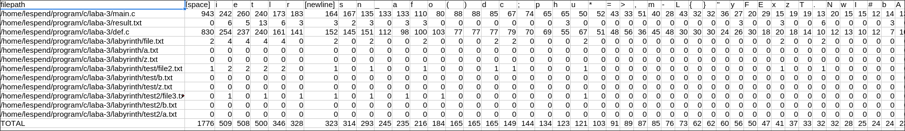

# Подсчет количества символов в файлах с определнными расширениями

Программа подсчитывает количество символов в файлах с определнными расширениями и выдает статистику в формате `csv`

## Установка
```sh
git clone https://github.com/baydakov-georgiy/char_statistics_analyzer.git
cd ./char_statistics_analyzer
```

## Использование
```sh
python char_statistics_analyzer.py [-r, -i] <директория> -e <расширения> [-o <выходной_файл.csv>]
```
Флаг `-r` отвечает за поиск файлов в любых поддиректориях внутри родительской на любом уровне вложенности

Флаг `-i` отвечает за чувствительность к регистру при поиске расширений

Формат расширений - `.ext` или `ext`

**Пример №1**

Собирает статистику по символам для файлов в директории `/path/to/files` с расширениями `.txt`, `.c`, `.cpp` и сохраняет её в файл `my_stats.csv`
```sh
python char_statistics_analyzer.py /path/to/files -e .txt .c .cpp -o my_stats.csv
```

**Пример №2**

Собирает статистику по символам для файлов в директории `/path/to/files` (в том числе и подпапках) с расширением `.py`, при этом игнорируя регистр, то есть будут подходить файлы с расширениями `.py`, `.pY`, `.Py`, `.PY`
```sh
python char_statistics_analyzer.py -r -i /path/to/files -e .py -o my_stats.csv
```

**Пример №3**

Собирает статистику по символам для файлов в директории `/path/to/files` без расширений. Для этого флагу `-e` необходимо передать `.`.
Примеры допустимых вариантов, которые будут подходить под этот фильтр: `exp.`, `file`, `file.part.`, `....`, `..`
```sh
python char_statistics_analyzer.py -r /path/to/files -e . -o my_stats.csv
```
